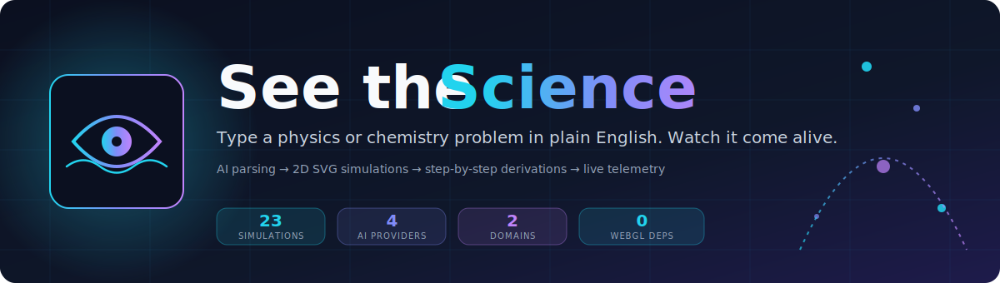
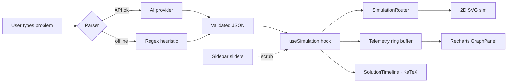
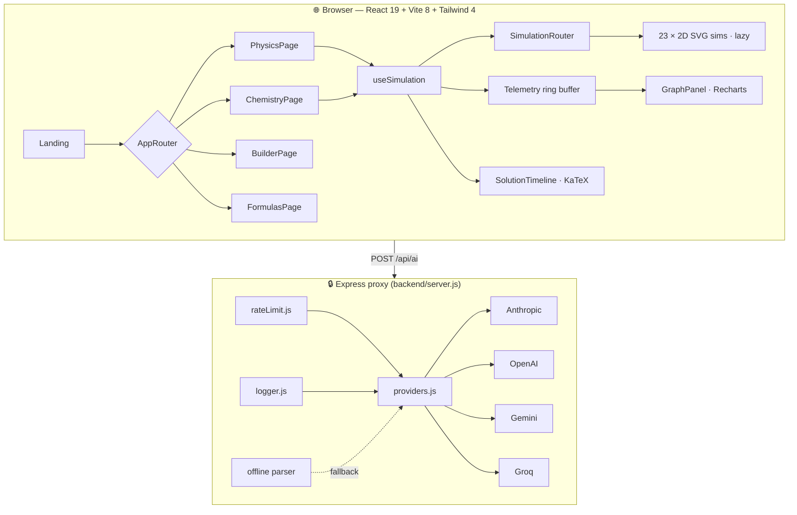

<p align="center">
  
</p>

<p align="center">
  <a href="#"></a>
  <a href="#"></a>
  <a href="#"></a>
  <a href="#"></a>
  <a href="#"></a>
  <a href="#"></a>
</p>

<p align="center">
  <b>Type a physics or chemistry problem in plain English. Watch it come alive.</b><br/>
  <sub>AI parsing · 23 interactive 2D simulations · step-by-step derivations · live telemetry · deterministic physics sandbox</sub>
</p>

<p align="center">
  <a href="#quickstart">Quickstart</a> ·
  <a href="#simulations">Simulations</a> ·
  <a href="#the-pipeline">Pipeline</a> ·
  <a href="#architecture">Architecture</a> ·
  <a href="#the-builder">Builder</a> ·
  <a href="#ai-providers">AI providers</a> ·
  <a href="#deployment">Deploy</a> ·
  <a href="#extending">Extend</a>
</p>

---

## Why

Physics tools on the web tend to fall into two camps: **pretty animations you can't modify**, or **equation-solver calculators with no visual intuition**. Students get neither the why nor the what.

SeeTheScience does both, in one loop:

1. You paste a word problem.
2. A language model extracts `{variables, units, assumptions, target}` as JSON.
3. The right 2D simulation is chosen, parameterized, and rendered live.
4. A step-by-step derivation (KaTeX) scrolls alongside, synced to playback.
5. A Recharts telemetry panel plots whatever the simulation reports — position, energy, momentum, field strength — frame by frame.
6. You scrub any variable. The sim pauses, reseeds, and replays.

No 3D cameras. No WebGL tax. Just the problem → the physics.

## Feature tour

| | |
|---|---|
| 🧠 **Natural-language parser** | One-shot `problem text → JSON`. Offline regex parser kicks in when the API is down so demos never die on bad WiFi. |
| 🎞️ **23 interactive sims** | Mechanics, E&M, optics, thermo, fluids, nuclear, and chemistry. Every one lazy-loaded as its own chunk. |
| 📈 **Live telemetry** | Per-frame Recharts plots. Energy conservation drift is flagged in red so broken sims are obvious. |
| 🎛️ **Variable scrubbing** | Sidebar sliders reseed the sim instantly. Compare two runs with different params on the same axes. |
| 🧾 **Solution timeline** | KaTeX-rendered derivation, synced to playback. Step highlighting tracks the current simulation phase. |
| 🏗️ **Scene Builder** | Drag-drop rigid-body playground. Ball-to-ball collisions, per-object material overrides, undo/redo, energy HUD, trail rendering, URL-shareable scenes. |
| 🧪 **Quiz & tutor** | Model-generated MCQs grounded in the live data stream — not generic textbook questions. |
| 🧬 **Multi-concept pipeline** | Chain sims ("projectile lands on incline") into staged scenarios. |
| 🔌 **4 AI providers** | Anthropic, OpenAI, Gemini, Groq. Mix and match; auto-failover to the first key that responds. |
| 🛜 **Offline-first** | Every surface degrades gracefully when no key is present. |
| 🔐 **Keys never leak** | Provider calls go through the Express proxy. The browser never sees an API key. |

## Quickstart

```bash
git clone <your-fork>.git seethescience && cd seethescience
npm install
npm run dev:all        # frontend :5173 + backend :4000
```

Open <http://localhost:5173>. No API key is required — the offline parser and every simulation work out of the box.

### Enable AI parsing (optional)

```bash
cp .env.example .env
# drop any one (or all) of:
#   ANTHROPIC_API_KEY=sk-ant-...
#   OPENAI_API_KEY=sk-...
#   GEMINI_API_KEY=...
#   GROQ_API_KEY=gsk_...
npm run dev:all
```

The app auto-picks the first provider with a live key. Pick a different one from the sidebar dropdown at any time.

## Simulations

<p align="center"></p>

| Category | Topics |
|---|---|
| **Mechanics** | Inclined plane · Projectile motion · Pendulum · Circular motion · Collisions · Rotational mechanics |
| **Energy & gravity** | Spring–mass (SHM + damped) · Gravitational orbits |
| **Waves** | Transverse · longitudinal · standing · interference |
| **Fluids & thermo** | Buoyancy · Bernoulli · Ideal gas PV diagrams · Maxwell–Boltzmann |
| **E & M** | Electric fields + equipotentials · Magnetic fields · Circuits |
| **Optics** | Lenses · mirrors · ray diagrams |
| **Nuclear** | Radioactive decay · chain decay · half-life |
| **Chemistry** | Organic chemistry · stoichiometry · titration · atomic structure · gas laws · chemical bonding · combustion |

Every entry in the in-app Physics and Chemistry libraries maps 1:1 to a live simulation file.

## The pipeline



The parser always returns JSON with the same shape, whether it came from a 70B model or a 30-line regex:

```json
{
  "domain": "physics",
  "type": "projectile",
  "variables": { "v0": 25, "theta": 60, "g": 9.81 },
  "units":     { "v0": "m/s", "theta": "deg", "g": "m/s^2" },
  "steps":     [ { "label": "Decompose velocity", "latex": "v_{0x} = v_0\\cos\\theta", "value": 12.5 } ]
}
```

Because the contract is fixed, the renderer and the derivation never need to know *how* the problem was parsed.

## Architecture



**Where to look**

| Path | What's in it |
|---|---|
| `src/simulations/*2D.jsx` | One self-contained SVG simulation per topic. |
| `src/simulations/matterBridge.js` | Matter.js adapter used by rigid-body sims. |
| `src/hooks/useSimulation.js` | Playback state, circular telemetry buffer, variable scrubbing. |
| `src/components/SimulationRouter.jsx` | Lazy-loads the right simulation by `type`. |
| `src/utils/problemParser.js` | AI call + offline heuristic parser. |
| `src/pages/BuilderPage.jsx` | Drag-drop scene editor with its own physics engine. |
| `backend/server.js` | Express entry, routes, env wiring. |
| `backend/providers.js` | One adapter per LLM. Uniform `{prompt} → json` surface. |

## The Builder

The Builder is a standalone 2D rigid-body playground. It's *not* an LLM surface — it's a deterministic sandbox for intuition-building.

**Under the hood**

- **Fixed 120 Hz timestep** with an RAF accumulator. Physics is identical on a 60 Hz laptop and a 240 Hz monitor.
- **Mass-weighted elastic ball-to-ball collisions** with normal-impulse response and tangential friction.
- **Per-segment material overrides** — restitution and friction can be globally controlled by world sliders and locally pinned per wall/ramp.
- **Pinned (kinematic) balls** — infinite effective mass, useful as anchors.
- **100-step undo/redo**, one history entry per drag or discrete edit.
- **Shift to snap** to a 0.5 m grid while dragging or dropping.
- **Position trails**, toggleable.
- **Energy HUD** — live KE, PE, total E, and max speed across all balls.
- **URL-encoded scenes (v2)** — world state + entities. v1 array-only scenes still load.

**Keyboard**

| Shortcut | Action |
|---|---|
| `Space` | Play / pause |
| `Delete` / `Backspace` | Remove selected |
| `Esc` | Deselect |
| `Ctrl`/`⌘` + `Z` | Undo |
| `Ctrl`/`⌘` + `Shift` + `Z` / `Ctrl` + `Y` | Redo |
| `Ctrl`/`⌘` + `D` | Duplicate selected |
| `Shift` (held during drag/drop) | Snap to 0.5 m grid |

## AI providers

All provider calls pass through `backend/providers.js`. Keys never touch the browser; the frontend only sees `/api/ai`.

| Provider | Default model | Strengths | Env var |
|---|---|---|---|
| **Anthropic** | `claude-sonnet-4-20250514` | Best structured output, strong physics reasoning | `ANTHROPIC_API_KEY` |
| **OpenAI** | `gpt-4o` | Fast, reliable JSON mode | `OPENAI_API_KEY` |
| **Gemini** | `gemini-1.5-flash` | Free tier is generous | `GEMINI_API_KEY` |
| **Groq** | `llama-3.3-70b-versatile` | Lowest latency (~sub-second) | `GROQ_API_KEY` |

You can set none, one, or all four. The sidebar dropdown switches at runtime; the server picks up the change on the next request.

## Configuration

Full environment reference (see `.env.example`):

| Variable | Default | Purpose |
|---|---|---|
| `PORT` | `4000` | Express backend port |
| `NODE_ENV` | `development` | Standard node env |
| `LOG_LEVEL` | `info` | `debug` / `info` / `warn` / `error` |
| `VITE_API_URL` | `/api` | Frontend → backend base path |
| `VITE_OFFLINE_FALLBACK` | `false` | Force offline parser even if API reachable (demo mode) |
| `ANTHROPIC_API_KEY` | — | Enables Claude provider |
| `OPENAI_API_KEY` | — | Enables OpenAI provider |
| `GEMINI_API_KEY` | — | Enables Gemini provider |
| `GROQ_API_KEY` | — | Enables Groq provider |

## Scripts

| Script | What it runs |
|---|---|
| `npm run dev` | Vite dev server on `:5173` |
| `npm run dev:api` | Express API on `:4000` |
| `npm run dev:all` | Both concurrently |
| `npm run build` | Production bundle |
| `npm run build:analyze` | Bundle with visualizer |
| `npm run preview` | Serve the built bundle |
| `npm run lint` / `lint:fix` | ESLint |
| `npm run type-check` | `tsc --noEmit` |
| `npm start` | `NODE_ENV=production node backend/server.js` |

## Project structure

```
.
├── backend/               # Express proxy — keys never leave the server
│   ├── server.js          # entrypoint, routing
│   ├── providers.js       # one adapter per LLM
│   ├── rateLimit.js       # per-IP rate limiting
│   └── logger.js
├── public/
│   └── logo.svg           # eye-of-science mark
├── docs/
│   ├── banner.svg         # README hero
│   └── sims-grid.svg      # simulation catalogue
├── src/
│   ├── AppRouter.jsx      # BrowserRouter + Suspense + lazy routes
│   ├── pages/
│   │   ├── Landing.jsx
│   │   ├── PhysicsPage.jsx
│   │   ├── ChemistryPage.jsx
│   │   ├── BuilderPage.jsx       # rigid-body sandbox
│   │   └── FormulasPage.jsx
│   ├── simulations/              # 23 × *2D.jsx, lazy-loaded
│   │   ├── matterBridge.js       # Matter.js adapter
│   │   └── shared/               # axes, grids, arrowheads
│   ├── hooks/
│   │   ├── useSimulation.js      # playback + telemetry buffer
│   │   ├── usePerformanceMonitor.js
│   │   └── useSession.js
│   ├── components/
│   │   ├── SimulationRouter.jsx  # lazy switch by type
│   │   ├── SimulationCard.jsx
│   │   ├── GraphPanel.jsx        # Recharts
│   │   ├── ResizableSidebar.jsx
│   │   └── ui/                   # Button, Panel, PageHeader
│   ├── utils/
│   │   ├── problemParser.js      # AI + offline parser
│   │   └── physicsEngine.js
│   └── data/
│       └── demos.js              # canned problems per topic
├── .env.example
├── Dockerfile.frontend
├── Dockerfile.backend
├── docker-compose.yml
└── nginx.conf
```

## Deployment

### Docker

```bash
docker compose up --build -d
```

Two images: `frontend` (nginx serving the static bundle) and `backend` (node). They share a network; nginx reverse-proxies `/api/*` to the backend.

### Bare metal

```bash
npm ci
npm run build
NODE_ENV=production PORT=4000 node backend/server.js
# then point nginx at dist/ and reverse-proxy /api to :4000
```

A sample `nginx.conf` with the reverse proxy rule, gzip, and SPA fallback is included.

### DigitalOcean one-liner

```bash
ssh root@$DROPLET "cd seethescience && git pull && npm ci && npm run build && pm2 restart all"
```

## Extending

**Adding a new simulation** is three files:

1. **Renderer** — `src/simulations/YourTopic2D.jsx` exporting a component that accepts `(variables, onTelemetry)` and draws SVG.
2. **Register the type** — add it to `SUPPORTED_SIMULATION_TYPES` in `src/hooks/useSimulation.js`.
3. **Route it** — add a `case 'your-topic':` in both `getSingleSimulationProps` and `renderSingleSimulation` in `src/components/SimulationRouter.jsx`. Use the `/* webpackChunkName: "sim-your-topic" */` hint on the lazy import.

A canned demo in `src/data/demos.js` (with pre-filled `parsedData`) will also surface your sim in the library and the "Random demo" dice button.

## Performance

- **Code splitting** — every simulation is its own lazy chunk (typically 2–4 kB gzip).
- **App bundle** — ~909 kB / 255 kB gzip after lazy routes; the Landing page paints from a ~21 kB critical chunk.
- **Physics loop** — Builder runs a fixed 120 Hz sub-step with an accumulator; no tearing, no frame-rate coupling.
- **Telemetry** — circular buffer with a configurable window; GC pressure stays flat across long runs.

## Security

- API keys live in the backend `.env`. The frontend sees none of them.
- The Express proxy rate-limits per-IP (`backend/rateLimit.js`).
- No user-generated content is persisted server-side; scenes round-trip through the URL.
- `Content-Security-Policy` and `X-Frame-Options` are set via `nginx.conf` in the reference deployment.

## Roadmap

- [ ] Rotational dynamics in the Builder (pivots as real joints).
- [ ] Continuous collision detection for fast-moving balls.
- [ ] Export sim telemetry to CSV.
- [ ] Quiz mode across chained concepts.
- [ ] Offline-first PWA shell.

## FAQ

**Does anything need an API key to work?** No. Every simulation runs offline. AI parsing of free-form problems needs one; the sidebar's canned demos don't.

**Why SVG and not WebGL / Three.js?** First paint is faster, accessibility is better, and for 2D physics at 60–120 Hz there's no measurable benefit to pushing it onto the GPU. (We *did* ship WebGL versions first and replaced them — the repo is lighter and the sims are crisper for it.)

**How many simulations?** 23 distinct topics, each its own file under `src/simulations/`. The Builder is a 24th surface that's open-ended instead of per-topic.

**Can I use just one LLM provider?** Yes. Drop a single key in `.env`. The others stay disabled.

## Contributing

Pull requests welcome. The three-file "adding a simulation" recipe above covers most new contributions. For anything that touches the parser contract or the telemetry buffer, open an issue first so we can talk about the shape.

## License

[MIT](./LICENSE). Built with React 19, Vite 8, Tailwind 4, Matter.js, Recharts, KaTeX, Framer Motion, and Lucide icons.
